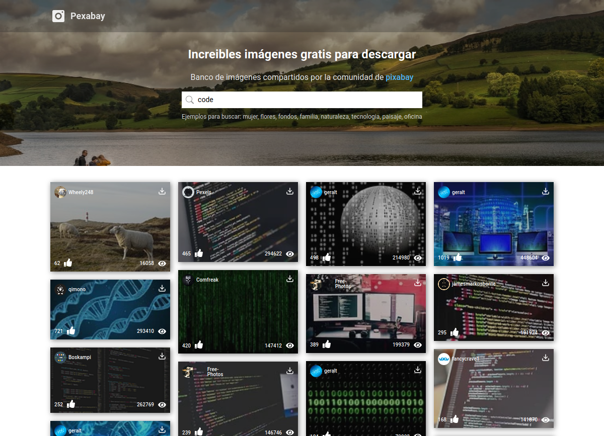

<h1 align="center">Banco de imágenes- Pexabay</h1>

<div align="center">
  Clone de pixabay realizado con react y consumiendo API de pixabay
</div>

<div align="center">
  <h3>
    <a href="https://pexabay-react-app.netlify.app/">
      Demo
    </a>
    <span> | </span>
    <a href="https://github.com/carlossantesp/pexabay-react">
      Solución
    </a>
  </h3>
</div>

## Tabla de contenido

- [Información](#información)
- [Desarrollado con](#desarrollado-con)
- [Instalación](#instalación)
- [Contacto](#contacto)

## Información



Clone de [Pixabay](https://pixabay.com) realizada con ReactJS y consumiendo los datos desde la [API](https://pixabay.com/api/docs/) de Pixabay

## Desarrollado con

- [React](https://es.reactjs.org/docs/getting-started.html)
- [CSS Modules](https://nextjs.org/docs/basic-features/built-in-css-support#adding-component-level-css)
- [API Pixabay](https://pixabay.com/api/docs/)

## Instalación

- Descargar el repositorio
  ```bash
  $ git clone https://github.com/carlossantesp/pexabay-react.git
  ```
- Instalar las dependecias

  **NPM**
  ```bash
  $ npm install
  ```

  **YARN**
  ```bash
  $ yarn install
  ```
- Ejecutar servidor de desarrollo

  **NPM**
  ```bash
  $ npm run start
  ```

  **YARN**
  ```bash
  $ yarn start
  ```

## Contacto

- Portafolio web [carlos.santillan.dev](https://carlos.santillan.dev)
- GitHub [@carlossantesp](https://github.com/carlossantesp)
- Linkedin [@dev-santillan-carlos](https://www.linkedin.com/in/dev-santillan-carlos)
